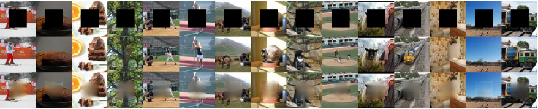
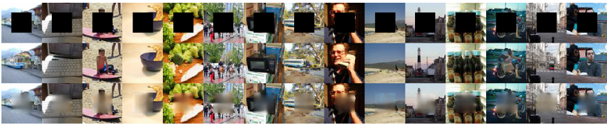
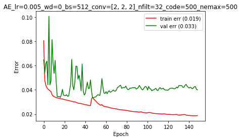

# IFT6266 Project : inpainting

Blog link : https://stephanielarocque.github.io/ift6266_project/  

# April 30th : Summary of my work

Sadly enough, I achieved my better results with y basic CNN network (as presented in April 15th blog post). Those results were blurry (probably because of the L2 reconstruction loss), but were still able to match the context and colors. However, when the image only represented a simple landscape, the basic CNN network is able to fill the inpainting correctly. 

#### Results from the training set : 

#### Results from the validation set : 

This model was composed of a 3 blocks of Convolution+Convolution+Pooling (including batch normalization) in order to recover the context from the 64x64 image, followed by 2 dense layers (one of size 500-- the code, and one to recover the right number of units to perform the upconvolution) and finally 2 blocks of Upsampling+Convolution+Convolution in order to recover a 32x32 image.
TODO : insert schema

I tried a lot of variants that finally didn't generate better quality images. Here is a very brief summary:

### Captions

I first tried using a bag of words embedding for the captions (1 and 5 captions), but that didn't change the overall quality of the images. To make the captions more useful, I tried better embeddings, first using LSTM and then GRU layers. However, the captions didn't improve the image generation quality. I think using a more deeper architecture for the caption embedding could have help a lot.

### Adversarial set-up

In order to obtain less blurry results and more interested inpainting, I tried GANs. Since I had already implemented a GAN network at the beginning of this project (without result), I used that implementation to add a discriminator in top of my conv-deconv CNN network that already produces interesting yet blurry images.  

However, I didn't get to have nice, smooth and full of details images. I tried a LOT of things to improve generator/discriminator efficiency in their own task, without really nice results. Here are some of the variants that I have tried :
- Use of batch norm (always)
- Label smoothing (for true image only)
- Different learning rates
- Different activation functions for intermediate layer (rely, leaky relu..) and for last layer of the generator (no activation, sigmoid, tanh, clip..)
- Alternative training for generator/discriminator (more or less)
- Noise added to true images
- Different loss functions (not saturating game)
- Whole image instead of just the inpainting for the discriminator
- Pretraining the generator
- WGAN with all the above variants tested

Unfortunately, I didn't get the results I expected

### Acknowledgements

I used the dataset loader and the caption preprocessing from Francis Dutil. I had also interesting discussions with him and other people  in the lab, including Sandeep and people outside Deep Learning course.

### Papers

- Generative adversarial networks [pdf](https://arxiv.org/pdf/1406.2661.pdf)
- Wasserstein GAN [pdf](https://arxiv.org/pdf/1701.07875.pdf)
- Generating Images from Captions with Attention [pdf](https://arxiv.org/pdf/1511.02793.pdf)
- Generative Adversarial Text to Image Synthesis [pdf](https://arxiv.org/pdf/1605.05396.pdf)
- Context Encoders: Feature Learning by Inpainting [pdf](https://arxiv.org/pdf/1604.07379.pdf)
- Unsupervised Representation Learning with Deep Convolutional Geneartive Adversarial Networks [pdf](https://arxiv.org/pdf/1511.06434.pdf)
- NIPS 2016 Tutorial: Generative Adversarial Networks [pdf](https://arxiv.org/pdf/1701.00160.pdf)
- Batch Normalization: Accelerating Deep Network Training by Reducing Internal Covariate Shift [pdf](https://arxiv.org/pdf/1502.03167.pdf)
- Conditional Image Generation with PixelCNN Decoders [pdf](https://arxiv.org/pdf/1606.05328.pdf)
- Densely Connected Convolutional Networks [pdf](https://arxiv.org/pdf/1608.06993.pdf)
- Deep Learning Book [website](http://www.deeplearningbook.org/)

### If I want to continue...
- First step must be to find the bug in my code that stops me from using GANs. I talked with other people in the lab, and they didn't have all the problems I had by training GANs, so my guess is that there are some bugs that I could not find in my GAN inplementation.
- Use a better embedding for captions (a more useful embedding)

# April 28th : Other investigations with W-GAN

Since my model wasn't even able to overfit a small subset (like you can see in the picture below), I tried a bunch of other variants to find a set-up where the generator/discriminator could both learn in an useful way.

### Learning rates
- Different set-ups for learning rates were tried (learning rate for the discriminator often smaller than generator's learning rate)
- I added learning rate annealing : at each epoch, the learning rates for both generator and discriminator were set to 0.99\*previous_learning_rate

### Activation functions

For the last activation function of the generator, I tried using 
- No activation function
- Sigmoid (since it's bounded between 0 and 1)
- Tanh (since it's still bounded)
- Custom activation : clip each pixel value beetween 0-1 (with an added term in the loss function MSE(before clip, after clip) in order to avoid saturating all the pixels)

But that didn't help. I also tried using no activation function for the discriminator (instead of the usual sigmoid activaiton for binary classification), since the value of the adversarial loss is based on the difference between prediction_true_image and prediction_fake_image. However, my discriminator almost always predict the fake images as true ones. By doing so, the generator doesn't get any gradient from the adversarial term in his loss, and the discriminator is stuck in a loss near 0 (since prediction_true_image ~= prediction_fake_image ~= 1)

### Optimization algorithm
- Since the beginning, I had my experiments running with Adam optimizer. I tried with RMSprop instead on a really small dataset (about 500 images), and it didn't even overfit on that dataset (as you can see in the image below)
- I also try addind Nesterov momentum, but that didn't help neither

However, these are the results for some of the first epochs on that small dataset:

Epoch 0 : It seems that the adversarial term helps the generator (since the generated inpainting is not blurry)

Epoch 1 :

Epoch 3 : Saturating pixels (maybe because of the clip activation)

Epoch 5 :

Epoch 7 : It seems the generator predict inpainting but not totally related to the contour.

# April 27th : W-gan without captions, checkerboard artefacts

Here is what happen in training (for a small subset of 500\*1000 images from the training set) for a few epochs : 

These are random samples from the last minibatch of the specified epoch.

#### Epoch 0 : Random color

#### Epoch 1 : All white (happens a often, sometimes becomes white again before restarting to learn useful stuff)

#### Epoch 2 : Noise

#### Epoch 4 

#### Epoch 5 : Almost all brown

#### Epoch 7 : Learning luminosity near the border, also some checkerboard artefacts

#### Epoch 13 : If we look really really fast, does look like a real picture  

These results were achieved with a reconstruction loss + wgan loss for the generator, without using the captions (on a small subset of the training set). It was not trained to convergence since I wanted to analyse how the generator prediction changes over time in the early training.

About checkerboard artefacts, I looked at that blog : http://distill.pub/2016/deconv-checkerboard/ but didn't find something that I could improve on my model to prevent those checkerboard artefacts, since :
- I had no deconvolution/transpose layers
- They were replaced by upscaling + convolution layers
- My upscaling layers already used the "repeat" mode instead of filling with 0s
So.. I don't really know where it comes from.

# April 26th : Other types of embedding for captions

I tried and compared :
- No caps
- With 1 or 5 caps (bag of word embedding)
- LSTM 
- GRU

However, I think that my embeddings were not powerful enough, because it didn't make a lot of difference with or without the captions. The difference between 0 caption, 1 caption BOW embedding, 5 captions BOW embedding, LSTM embedding and GRU embedding was too small to be perceptible (so I didn't put the results here, since it doesn't add anything).

Also, I tried to use a conv-deconv model with captions (from the different embeddings), but restricting the contribution from the context (the image border) to 1 unit, compared to 500 units from the captions. The model just didn't converge and ouput random gray inpaintings. That's also why I think that my embeddings were not useful.  

An other thing that we could try, instead of concatenating the code from the context path and the code from the captions path, could be adding the captions code as the bias term of the last convolution layer from the downsampling path (with an appropriate reshape). That could directly inflence the convolution features, maybe more then only concatenating the 2 codes in the dense layer in the middle.

### Next steps
- For now on, I will only use the context CNN/GAN without captions, since it doesn't help the image quality enough to justify the added computation time.
- Retry W-GANs...

# April 24th : W-GAN

After talking with Sandeep, I tried Wasserstein GAN (https://arxiv.org/pdf/1701.07875.pdf). The main reason why I tried this is because it avoids the NaN problem. Instead of using the log loss:

 L_disc_gan =  - [log( D(true_images) ) + log( 1-D(fake_images) ) ]

it uses

 L_disc_wgan = -0.5 * ( D(true_images) - D(fake_images) )  

So by minimizing L_wgan, we maximize D(true_images) - D(fake_images), so it pushes the discriminator's prediction towards 1 for true images and towards 0 for fake images (like in standard GAN). Also, for the generator, the loss becomes:

 L_gener = MSE(fake_images, true_images) - 0.5 * D(fake_images)  

So, by minimizing L_gener, we minimize the MSE (the reconstruction error) and maximize the discriminator's prediction on the fake images (D(fake_images)).   

Also, I used parameter clipping for the discriminator when the norm was not in the range (-0.05, 0.05) to enforce a Lipschitz constraint. It makes the discriminator weaker and give a chance to the generator.

### First thoughts

- It does not output NaN!! What a relief.
- After training on a really small subset of the dataset (~1000-2000 images), it does converge. It's still blurry but less than without generator.
- Also, I changed my generator output nonlinearity from relu to tanh.

### And then...

I tried to make that results with bigger subset of the dataset, but it didn't work. I think it was beginner's luck and a bit of Jupyter notebook magic (since I trained the network with different hyper-parameters such as learning rates but it remembered the previous parameters values). I was not able to reproduce it, even though I tried a dozen of different hyper-parameters.

### Results

Unfortunately, it seems that the discriminator "choose" to say that all images are true almost everytime. At the beginning of the training, it outputs random labels and then gradually output all "1s", for both true and generated iamges. Even though the discriminator loss could be lower if it outputs "0s" for fakes images, it seems that it is stock in a bad local minima or a plateus, because it doesn't escape it easily (or sometimes, never escape it) and keep a loss=0 (so always predict 1s).   

I tried different training set-ups regarding the ratio *number of time generator is trained* vs *number of time discriminator is trained*. However, that didn't and i got these bad results (for GANS). Note that the generator keep generating images like in the first picture. Often, it gets in a better state where it produces better images, but then it gets a bad gradient and returns often in its first state.

As you can see, it stays a very blurrrrry inpainting. It seems that the reconstruction loss

### Next steps
- Try different hyperparameters to understand their effect on the global performance
- If time permits it, retry GAN (not W-GAN) but with tanh output nonlinearity for the generator
- If time permits it, try this set up with/without captions (bag-of-words embedding) to see its effect 
- If time permits it, compare those results with only GAN and/or only W-GAN loss (instead of joint loss) for the generator
- Caption stuff : try using an LSTM/GRU layer instead of bag-of-words embedding (work in progress...)

# April 23th : NaNs instead of GANs

I tried implementing a joint loss as in this paper (https://arxiv.org/pdf/1604.07379.pdf)

 L = a * Lrec + (1-a) * Ladv, 

  
 where Lrec is the reconstruction loss used in "contour+captions to center" model (the MSE between generated and true center) and Ladv is an adversarial loss obtained by a discriminator that takes the generated images and the true images as input. 

The purpose of this new joint loss is to take advantage of both GANs and L2 reconstruction :
- L2 reconstruction gives a smooth border and rights colors, but is very blurry
- GANs give sharp results (sometimes abstract results) but miss to give smooth transition between border and center.

Since my basic CNN model (which is an encoder-decoder that incode the contour as well as the captions and decode to the center of the image) gives good results for a pixel wise reconstruction loss (MSE), I thought adding this GAN/adversarial loss could help to give sharper inpaintings.

I only had to take the discriminator from my GAN's implementation and put it on top of the basic CNN model (that acts like the generator in the GAN set-up). Like I explained in my first posts, since I am using Lasagne, I need to have 2 discriminators:
- D : Discriminator for true images only
- D_over_G : Discrimator for fake images only (take the output of the generator as input)

I thought that it would give at least as good results as my basic CNN model easily, but it didn't. Each time I tried running this joint loss, the discriminator loss (Ladv) always goes to NaN, so that stops the training. I tried a lot of things to avoid that problem, without success. This happens because the discriminator gets too confident on rejecting the generated images or accepting the true images (log do not like 0s...). 

## NOT CONVERGING RESULTS

Since the discrimator gives a NaN cost after only few minibatches/epochs, then the whole model do not converge. It stays in an early stage of abstract inpainting or in a gray-inpainting scheme.

These are all the strategies I tried to avoid the discriminator's confidence.

### 1. Label smoothing
As proposed in a few papers (https://ift6266h17.files.wordpress.com/2017/03/goodfellow_gantutorial.pdf), labels smoothing for the true images is a good way of preventing the discriminator to have a bad (or no) gradient. Instead of using:
- loss_fake = binary_crossentropy(fake_images, 0)
- loss_true = binary_crossentropy(true_images, 1),

I tried using:
- loss_fake = binary_crossentropy(fake_images, 0)
- loss_true = binary_crossentropy(true_images, 0.9)  

to prevent the discriminator to be too confident on the real images. Note that we only smooth the true images labels, since it would change the discriminator shape.
However, the NaN problem still occured.

### 2. Architecture changes for discriminator
- Average Pooling : I changed any max-pooling layer in my discriminator for an average-pooling layer to prevent too small/sparse gradient, but that didn't change the NaN problem. 
- Strided convolution : I also tried Strided convolution instead of pooling layers, but that didn't help much.
- LeakyRectify : Use of Leaky relu instead of relu didn't change training enough neither, for different values of leakiness.

I was already using batch normalisation for each convolution.

### 3. Learning rates 
I tried different learning rates. A smaller learning rate (~0.0001) for the discriminator than generator's learning rate (~0.01) was needed to obtain some results (a few epochs) before NaNs, but NaNs still occured after ~5-10 epochs.

### 4. Alternating training set-up
I also tried different training set-ups for alternating SGD (between 1 and 10 steps for the generator for 1 step of the discriminator). Even if some papers say that the discriminator might need more training, my own discriminator just become too confident when trained more than the generator, so the output of discriminator is too close to 0 or 1, and that hurts training.

### 5. Loss functions 
At first, I tried: 

---------------------------------------------------------
fake_center = G(contour, captions)  
rec_loss = MSE(real_center, fake_center)  
adv_loss = -T.mean(T.log( D(real_center) )  + T.log( 1 - D(fake_center) ) )  

gen_loss = 0.5*rec_loss + 0.5* adv_loss  
discr_loss = -adv_loss  

---------------------------------------------------------

And then, like in the non-saturating game for GANS (and because updating the generator won't change the discriminator's prediction on the true images),  I switched to :

---------------------------------------------------------
fake_center = G(contour, captions)  
rec_loss = MSE(real_center, fake_center)  
adv_loss = -T.mean(T.log( D(real_center) )  + T.log( 1 - D(fake_center) ) )   

gen_loss = 0.5*rec_loss - 0.5* T.mean( T.log( D(fake_center)  ))  
discr_loss = -adv_loss  

---------------------------------------------------------

### 6. Noise on the true image given to the discriminator

I added a gaussian noise for the discriminator input when it's the true image center, also to avoid a too high confidence for the discriminator. I tried different values for the noise std, but that didn't help. I think this is because the discriminator is also too confident on rejecting generated images, but that noise didn't help reducing that confidence.

### 7. Whole image discriminator
Instead of using only the inpainting image as input to the discriminator, I reconstructed the whole image (contour + true/generated center). I thought that it would be easier for the discriminator to understand that the colors must match and the transition must be smooth between the inpainting and the contour with that strategy. However, the discriminator instead got too confident (again..) and output NaN.

### 8. Pretraining the generator only on the reconstruction loss

Because the discriminator is too confident, I thought that using my pretrained generator model weights (basic CNN model) as the initial weights could help as a pretraining. In the joint/adversarial loss set-up (reconstruction+adversarial loss), the generator never achieve the same image quality as the generator using only reconstruction loss. It only outputs abstract inpaintings before crashing to NaNs. I thought that if the generator is already a bit pretrained, then the generator would only need to understand the difference between a blurry and not-blurry image. I thought that it would be easier to train. But it was worse, because after only 1 or 2 minibatches, the discriminator loss went to NaN, again.

## Conclusion

1. Training GAN is hard
2. I must do a big change in my architecture, since all those changes didn't help training
3. Probably look to Wasserstein GANS (https://arxiv.org/pdf/1701.07875.pdf), since its purpose is mainly to change the loss function in order to always have a gradient, even if discriminator is too confident.
4. Captions : I will also try an other embedding using LSTM/GRU layer if time permits it.

# April 20th : Adding captions

Even though my L2 reconstruction network (similar to AE) is not as good at it can be (very blurry, maybe some other hyperparameters would be better), I wanted to know how much the captions could help. I used Francis Dutil's preprocessing to process the captions (remove stop words, only keep words occuring at least 10 times, switch to numbers) to get a vocabulary of +-7500 words. Next step to be able to use those processed captions was to find an embedding useful for this task.

The embedding I first tried is a bag-of-word.

Let's say we have the caption cap = [3, 45, 23, 8] (3rd word of the vocabulary, 45th, 23th and 8th word), it will be converted to a one hot bag of word : a vector ~7500 zeros (size of vocabulary), except at positions 3, 45, 23 and 8, where it will be 1s (indicating that these words are present in the sentence). 

### 1 caption
As a starting point, I only used 1 caption per image. Each caption, as explained above, was a vector of +- 7500 digits. To obtain a useful representation, I used a dense layer from this vector to a vector of size 100. I then concatened this 100-vector to the 500-vector of latent variables obtained by convolution and pooling from the image's contour. With that new "latent code" of size 600, I used the same architecture as presented on April 15th post.

### 5 captions
Once I got this running, I thought it could be useful to use all the 5 captions instead of only 1. To do so, I extracted the 5 one hot bag of words for all of these 5 captions, so I had 5 vectors of size +- 7500, and then averaging them to get only 1 vector of size +-7500. I used that averaged bag of words as the captions' latent variables.

### Results
The results looks lot like without captions though.

1 caption:

5 captions :

This architecture (for no/1/5 caps) had a learning rate = 0.01, no weight decay, 4 block of convolution+pooling, 32 filters at the beginning of the network (double at each pooling layer) and a latent code of 500 units.

1 caption:

5 captions :

This architecture (for 1/5 caps) had a learning rate = 0.01, no weight decay, 3 blocks of convolution+pooling, 32 filters at the beginning of the network (double at each pooling layer) and a latent code of 750 units.

From these last results, it seems like 1 caption help more than 5 captions. Is it me or is it a zebra shadow?

Multiple architecture were tested, including a change in the learning rate, in the latent code size, in the number of convolutions, in the size of the filters, etc. However, the results looks pretty much all the same and achieve their best results around the 20th epoch.

### Next steps
- Try using a GRU/LSTM layer instead of a Dense Layer (and then no need to have a +-7500 vector)

# April 15th : Basic Results

Since my Vanilla GAN model is harder to train than expected, I started to code a basic convolutional net to obtain some results. 

My model is composed of 
- INPUT = Image border (64x64 with a black 32x32 square in the middle)
- Conv+Conv+Pooling
- Conv+Conv+Pooling
- Conv+Conv+Pooling
- Reshape Layer
- Dense Layer of size 500 (to obtain the latent variables)
- Dense Layer
- Reshape Layer
- Upscale+Conv+Conv
- Upscale+Conv+Conv
- OUTPUT = Image center (32x32)

Other specifications : all convolution layers use batch normalization
I used L2 loss as a starting point.  
Note that the dense layer is important here since, without it, it always give an inpainting with a weird gray square in the middle on the inpainting. 

### Results
Here are the results for a subset of the validation set after 115 epochs :

Top = Input of the model, Middle = Ground truth, Bottom = Generated image

These are, unsuprisingly, blurry. Furthermore, the colors do not always match with the border (maybe because of batch norm with mode collape?). Using a GAN setup could help, even more if the whole images (border+center) are given to the discriminator : the colors would maybe match more the border. Using a GAN (adversarial loss) can also help to make the generated images sharper.

### Next steps
- Add the captions in this model and see if it helps 
- Use an adversarial loss (and L2 loss) as in this paper : https://arxiv.org/pdf/1604.07379.pdf

# March 20th : Gan abstract inpainting

My GAN model doesn't perform well. Since I thought my Jupyter Notebook was using GPU, but wasn't, I had problems because it just freezed my screen and everything when I tried to run 1 epoch. I finally got my GAN to "train", but NaNs occur after 2 or 3 epochs - and therefor *very* bad results for the generator.

#### Next steps :
- Look at the DCGAN architecture and try it.

#  March 15th : First try implementing GAN

These last weeks, I tried to implement a GAN (in order to extend it, once it works, to a conditional gan, for example)
#### Problem : 
Discriminator implementation in Lasagne 
#### Explanation : 
Since the discriminator takes the output of the generator AND true images, the "input" of the discriminator is not well defined in Lasagne 
#### Solution : 
We need to create 2 discriminators, once built on top of the generator, and the other one taking the true image as input that share weights (to simulate 1 single discriminator)
So I have built a GAN model that has 3 attributes:
  - G : Generator
  - D : Discriminator (input = true images), share weights with D_over_G
  - D_over_G : Discriminator (input = fake images = output from G), share weights with D

Note that I used Francis Dutil's data loader.

